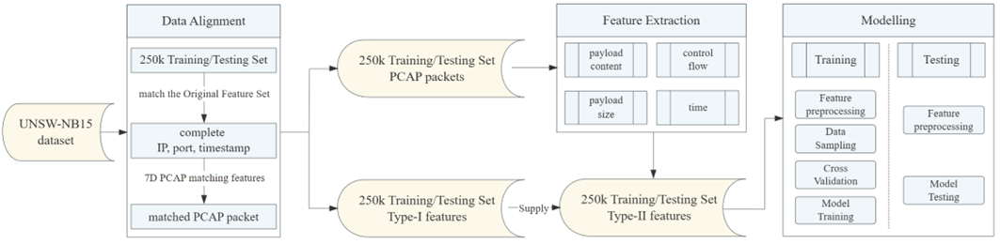

# Abstract
This code repository is related to threat detection and is used to enhance features in the original UNSW-NB15 threat detection dataset. The newly added features (referred to as Type II features) can further improve the expressive capability of traffic data, and significant performance improvements have been validated across multiple models. The enhanced training and validation data can be used to train and validate new algorithms. Here, we share our processed and enhanced UNSW-NB15 dataset, as well as the relevant feature processing and model training code. If you have any questions, please feel free to contact us.

# Dataset
## UNSW-NB15 Dataset
UNSW-NB15 public dataset.

part of important dataset is available here :
- Statistical features of 2.5 million flow data: `UNSW_NB15_x.csv` (1, 2, 3, 4)
- Statistical features of 250,000 flow data: `UNSW_NB15_trainging-set.csv`, `UNSW_NB15_testing-set.csv`

the complete data is available here:[The UNSW-NB15 Dataset](https://research.unsw.edu.au/projects/unsw-nb15-dataset)
## Deep Feature
The deep feature we extract by using proposed deep feature extraction method.
- feature_7.*.rar

`Feature Description.xlsx`: Detailed feature description document.

# Code

## feature_extract
Data Alignment and Feature Extraction based on the original UNSW-NB15 dataset
### File Function Description
List of Files and Their Functions:

- Data Alignment: File 1.2.4.5 
- Feature Extraction: File 3.7

**1. main_format_NUSW-NB15_data.py**

Correct and format the data of NB15.

**2. main_NUSW-NB15_2_mongoDB.py**

Insert NB15 data into mongoDB.  

    Input: All data of UNSW-NB15.  
    Output: mongoDB_client["paper2"]["data1008"]

**3. main_parsing_PCAP_2_packet_data.py**

Parse PCAP into packet communication packets and extract basic features as well as statistical features based on communication content.  

    Input: PCAP  
    Output: mongoDB_client["paper3"]["data1010"]

**4. main_matching_testing_training_set.py**

Match the testing and training datasets with the entire UNSW-NB15 dataset. The matching result includes one-to-many (indices).  
Note: At this step, the indices of the testing and training datasets corresponding to the entire UNSW-NB15 dataset are obtained.  

    Input: UNSW_NB15_testing-set.csv & UNSW_NB15_training-set.csv  
            client["paper2"]["data1008"]  
    Output: client["paper0"]["matching_UNSW_NB15_testing"]  
            client["paper0"]["matching_UNSW_NB15_training"]

**5. main_merge_1c_feature_testing_training.py**

Expand the one-to-many indices from Step 4 into one-to-one data.  
During data expansion, there is a timeout issue that needs to be bypassed using the no_cursor_timeout=True).batch_size(5000) method.  

    Input: mongoDB_client["paper0"]["matching_UNSW_NB15_testing"]  
            mongoDB_client["paper0"]["matching_UNSW_NB15_training"]  
            mongoDB_client["paper2"]["data1008"]  
    Output: mongoDB_client["paper5"]["merge_1_category_testing_features"]  
        mongoDB_client["paper5"]["merge_1_category_training_features"]

**6. main_give_the_optimal_class_1_feature_testing_training.py**

Reduce one-to-many features to one-to-one by randomly selecting and using minimum distance judgment.  
Minimum distance: Select the feature with the smallest distance between the testing and training datasets and the entire UNSW-NB15 dataset.  
    
    This is Type I Features.  
    
    Input: client["paper5"]["merge_1_category_testing_features"]  
            client["paper5"]["merge_1_category_training_features"]  
    Output: client["paper5"]["give_the_optimal_class_1_features_testing"]  
            client["paper5"]["give_the_optimal_class_1_features_training"]

**7. main_characteristics_1_category2.py**

(1) **make_mediacy_group_5_tuples_time**  
Statistical analysis of 5-tuples, start and end times for the entire UNSW-NB15 dataset, and record the correspondence between 5-tuples and raw data.  
    
    Input: mongoDB_client["paper2"]["data1008"]  
    Output: mongoDB_client["paper2"]["mediacy_group_5_tuples_time"]  

(2) **make_mediacy_pkt_info_set**  
List all statistical information extracted from packet data within the time window based on 5-tuples and times of UNSW-NB15.  

    Input: for -> mongoDB_client["paper2"]["mediacy_group_5_tuples_time"]  
            mongoDB_client["paper3"]["data1010"]  
    Output: mongoDB_client["paper3"]["mediacy_pkt_info_set2"]  

(3) **calculate_aggregate_features**  
Calculate statistical features within the time window of PCAP based on the results from (2).  

    This is Type II Features.  

    Input: mongoDB_client["paper3"]["mediacy_pkt_info_set2"]  
    Output: mongoDB_client["paper4"]["raw_2_category_features"]  

(4) **expand_1_category_features**  
Combine Type I and Type II Features.  

    ---Testing Set:  
    Input: mongoDB_client["paper5"]["give_the_optimal_class_1_features_testing"]  
            mongoDB_client["paper4"]["raw_2_category_features"]  
    Output: mongoDB_client["paper5"]["output_2_category_features_testing"]  

    ---Training Set:  
    Input: mongoDB_client["paper5"]["give_the_optimal_class_1_features_training"]  
            mongoDB_client["paper4"]["raw_2_category_features"]  
    Output: mongoDB_client["paper5"]["output_2_category_features_training"]

## model_validation
### Feature Files
- Feature Version 7: `input/us_features/feature_7.csv`
  - Description: Type-I and Type-II Feature (i.e., using deep feature extraction method)
  - You need to extract `data/feature_7.*.rar` to `input/us_features/`
### Code:
- `algorithm/`
  - `model.py`: Entry point for code
  - `xxx.py`: Definitions for various models
- `feature_process/`
  - `featurex.py`: Processing for Feature Version X
  - `feature`: General feature processing
- `analysis/`
  - `dataset_analysis.py`: Dataset analysis, including data imbalance
  - `feature_analysis.py`: Feature analysis, including feature importance
  - `shap_analysis.py`: SHAPley method for feature importance analysis
- `utils/`
  - `calculate_utils.py`: Visualization of experimental results
  - `sample_utils.py`: Code related to partial dataset sampling
- Entry Files
  - `run.py`: Entry for data processing, training, testing, and result analysis 
    - params (example: `run.py --kfold_random_state=0 --random_state=-1 --all_count=-1 --k_fold=5 --model_name="MLP" --feature_version="feature7/raw" --oversample_all=0`)
      - model_name: Model algorithm, {RFC, MLP, KNN, LR, Efficient, Autoencoder}
      - feature_version: Feature selection, choose feature file `feature7`, where `{raw, all}` represent Feature Type 1 and Feature Type 2, respectively.
      - k_fold: Value of k for k-fold cross-validation.
      - kfold_random_state: Random seed for k-fold cross-validation.
      - random_state: Random seed for mini-batch sampling.
      - all_count: Number of samples for mini-batch sampling.
      - oversample_all: Sampling algorithm.
  - `run.sh`: Script to execute `run.py`
  - `run_param.py`: Entry for model hyperparameter tuning
- requirements.txt

### Result Records
1. Training Records: `output_us/`
   - `output_us/avg_result_record.csv`
     - Records of experimental parameters and metrics
   - `output_us/output_shap_info.csv`
     - Records of experimental parameters and SHAP storage paths
2. Model Records: `model_us/`
3. SHAPLEY Records: `output_shap/`
4. Preprocessed Data: `dataset_us/`

### References
#### Efficient-CNN-BiLSTM-for-Network-IDS
Code for Paper: Efficient-CNN-BiLSTM-for-Network-IDS  
Paper is available here: [Efficient Deep CNN-BiLSTM Model for Network Intrusion Detection | Proceedings of the 2020 3rd International Conference on Artificial Intelligence and Pattern Recognition](https://dl.acm.org/doi/10.1145/3430199.3430224)